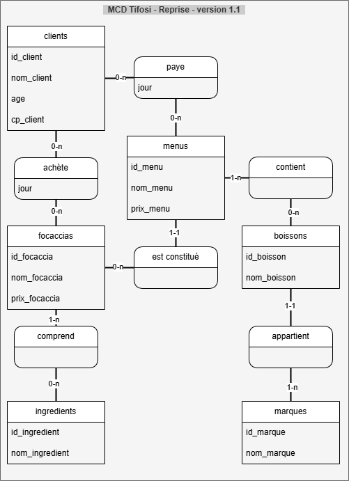

# Documentation : analyse littérale de la modélisation conceptuelle de données du projet

_Rédigé par :_ PerLucCo  
_Dernière mise à jour :_ 27 juin 2025  

---

Ce document reprend la définition du modèle de conception du sujet et l'exprime avec des expressions formelles de modélisation.
Les formulations sont basées sur les modèles MCD v1 et MCD v2 qui ont fait l'objet d'une définition préalable validée ([phase 2 - étape 4](../HISTORIQUE_mcd.md))

---

- [Documentation : analyse littérale de la modélisation conceptuelle de données du projet](#documentation--analyse-littérale-de-la-modélisation-conceptuelle-de-données-du-projet)
  - [Introduction](#introduction)
  - [✳️ Modélisation littérale des relations du MCD](#️-modélisation-littérale-des-relations-du-mcd)
    - [1. Relation `achète (ce jour)` (binaire)](#1-relation-achète-ce-jour-binaire)
    - [2. Relation `est_constitué_de` (binaire)](#2-relation-est_constitué_de-binaire)
    - [3. Relation `contient` (binaire)](#3-relation-contient-binaire)
    - [4. Relation `comprend` (binaire)](#4-relation-comprend-binaire)
    - [5. Relation `appartient` (binaire)](#5-relation-appartient-binaire)
    - [6. Relation `paye (ce jour)` (binaire)](#6-relation-paye-ce-jour-binaire)
    - [7. Relation `achète` (ternaire)](#7-relation-achète-ternaire)
    - [8. Relation `paye` (ternaire)](#8-relation-paye-ternaire)
  - [🧮 Synthèse des modélisations littérales](#-synthèse-des-modélisations-littérales)

---

## Introduction

Cette formalisation littérale repose sur deux modèles conceptuels de données :

| MCD v1.1 (modèle simple)                            | MCD v2.1 (modèle normalisé)                        |
|-----------------------------------------------------|----------------------------------------------------|
|  |  |

Le tableau ci-dessous identifie les **8 relations étudiées** avec leur numéro, intitulé, type (binaire/ternaire), entités impliquées et modèle concerné.

| N° | Intitulé de la relation    | Type     | Entités principales              | MCD concerné | Commentaire                              |
|----|----------------------------|----------|----------------------------------|--------------|------------------------------------------|
| 1  | `achète (ce jour)`         | Binaire  | clients, focaccias               | MCD v1.1     | Attribut `jour` intégré dans la relation |
| 2  | `est_constitué_de`         | Binaire  | menus, focaccias                 | v1.1 & v2.1  | Menu nécessite des focaccias             |
| 3  | `contient`                 | Binaire  | menus, boissons                  | v1.1 & v2.1  | Inclusion obligatoire de boissons        |
| 4  | `comprend`                 | Binaire  | focaccias, ingrédients           | v1.1 & v2.1  | Composition obligatoire                  |
| 5  | `appartient`               | Binaire  | boissons, marques                | v1.1 & v2.1  | Chaque boisson a une seule marque        |
| 6  | `paye (ce jour)`           | Binaire  | clients, menus                   | MCD v1.1     | Attribut `jour` intégré dans la relation |
| 7  | `achète`                   | Ternaire | clients, focaccias, jours        | MCD v2.1     | `jours` comme entité                     |
| 8  | `paye`                     | Ternaire | clients, menus, jours            | MCD v2.1     | `jours` comme entité                     |

---

## ✳️ Modélisation littérale des relations du MCD

### 1. Relation `achète (ce jour)` (binaire)

- Un _client_ peut _(0,n entre client et achète)_ **acheter (ce jour)** aucune ou plusieurs _focaccias_.  
- Une _focaccia_ peut _(0,n entre focaccias et achète)_ **être achetée (ce jour)** par aucun ou plusieurs _clients_.

---

### 2. Relation `est_constitué_de` (binaire)

- Un _menu_ **est nécessairement constitué** _(1,1 entre menu et est_constitué_de)_ d’**une ou plusieurs focaccias** _(1,n entre est_constitué_de et focaccias)_.  
- Une _focaccia_ peut _(0,n entre focaccias et est_constitué_de)_ **entrer dans la constitution de** aucun ou plusieurs _menus_.

---

### 3. Relation `contient` (binaire)

- Un _menu_ **doit contenir** _(1,n entre menu et contient_boisson)_ **une ou plusieurs boissons**.  
- Une _boisson_ peut _(0,n entre boissons et contient_boisson)_ **être contenue dans** aucun ou plusieurs _menus_.

---

### 4. Relation `comprend` (binaire)

- Une _focaccia_ **comprend nécessairement** _(1,n entre focaccias et comprend)_ **un ou plusieurs ingrédients**.  
- Un _ingrédient_ peut _(0,n entre ingrédients et comprend)_ **être compris dans** aucune ou plusieurs _focaccias_.

---

### 5. Relation `appartient` (binaire)

- Une _boisson_ doit _(1,1 entre boissons et boisson_appartient)_ **appartenir à** une seule _marque_.  
- Une _marque_ peut _(0,n entre marques et boisson_appartient)_ **avoir associée** aucune ou plusieurs _boissons_.

---

### 6. Relation `paye (ce jour)` (binaire)

- Un _client_ peut _(0,n entre client et client_paye)_ **payer (ce jour)** aucun ou plusieurs _menus_.  
- Un _menu_ peut _(0,n entre menus et client_paye)_ **être payé (ce jour)** par aucun ou plusieurs _clients_.

---

### 7. Relation `achète` (ternaire)

- Un _client_ peut **acheter** aucune ou plusieurs _focaccias_.  
- Une _focaccia_ peut **être achetée** par aucun ou plusieurs _clients_.  
- Un _jour_ peut être associé à **aucun ou plusieurs achats** entre _clients_ et _focaccias_.

---

### 8. Relation `paye` (ternaire)

- Un _client_ peut **payer** aucun ou plusieurs _menus_.  
- Un _menu_ peut **être payé** par aucun ou plusieurs _clients_.  
- Un _jour_ peut être associé à **aucun ou plusieurs paiements** de _menus_ par des _clients_.

---

## 🧮 Synthèse des modélisations littérales

| Élément de comparaison       | **MCD v1.1** (approche simple)             | **MCD v2.1** (approche normalisée)          |
|------------------------------|--------------------------------------------|---------------------------------------------|
| Nombre d’entités             | 6                                          | 7 (avec `jours`)                            |
| Relations                    | 6 (binaires)                               | 6 (4 binaires + 2 ternaires)                |
| Présence de la date          | Attribut `jour` redondant dans 2 relations | Dimension `jours` factorisée                |
| Cohérence sémantique         | Moyenne (risque d’incohérence de date)     | Élevée (centralisation des dates)           |
| Simplicité de modélisation   | Haute (lecture intuitive)                  | Moyenne (notion de relation ternaire)       |
| Préparation à l’analyse      | Limitée                                    | Excellente (analyse par jour facilitée)     |
| Forme normale atteinte       | 3NF (attributs fonctionnels)               | 4NF voire BCNF (élimination de redondances) |
| Évolutivité                  | Faible (structure figée)                   | Haute (structure normalisée et factorisée)  |

---

> Ces deux représentations expriment **le même modèle fonctionnel**.  
> Le choix entre v1.1 et v2.1 dépendra du niveau attendu de **normalisation**, de la **complexité tolérée** dans les traitements, et des **besoins d’historisation de l’activité**.

---
