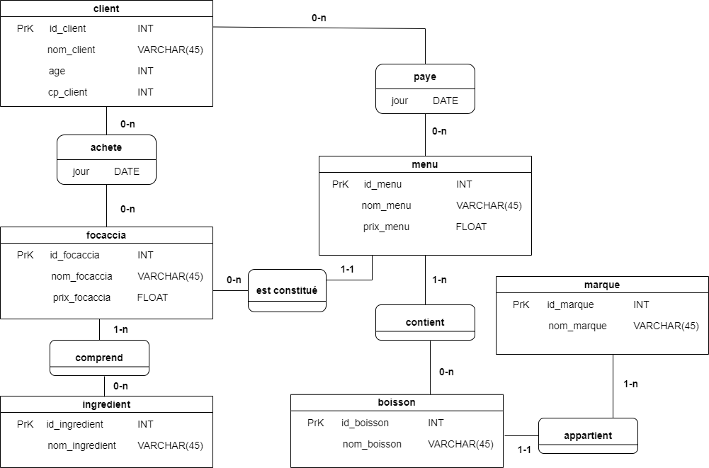
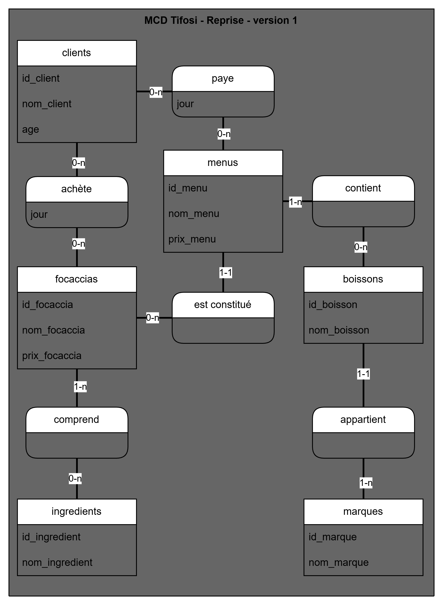

# 📘 README_analyse.md — Analyse du MCD (Projet Tifosi)

_Rédigé par :_ PerLucCo  
_Date :_ Juin 2025

Ce dossier regroupe l’ensemble des documents liés à l’analyse du **Modèle Conceptuel de Données (MCD)** du projet. Les informations intitales sont reprises du sujet fournis pour le projet.

- [`README_analyse.md`](README_analyse.md) : synthèse de la démarche et du modèle retenu
- [`mcd-tifosi_analyse.md`](mcd-tifosi_analyse.md) : tableau d’analyse technique complet des entités et relations
- [`mcd-tifosi_cohérence.md`](mcd-tifosi_cohérence.md) : critique sémantique du schéma de départ et hypothèses métier

➡️ Ces trois documents forment la base de la transition vers le Modèle relationnel Logique de Données (MRLD).

---

- [📘 README\_analyse.md — Analyse du MCD (Projet Tifosi)](#-readme_analysemd--analyse-du-mcd-projet-tifosi)
  - [🎯 Objectif du document](#-objectif-du-document)
  - [🖼 Présentation du schéma fourni](#-présentation-du-schéma-fourni)
  - [🧭 Conventions appliquées](#-conventions-appliquées)
  - [🔍 Analyse des relations](#-analyse-des-relations)
  - [🧠 Synthèse de l'analyse métier](#-synthèse-de-lanalyse-métier)
  - [🧭 MCD de référence retenu pour l'implémentation (V1)](#-mcd-de-référence-retenu-pour-limplémentation-v1)
  - [🔄 Suites prévues](#-suites-prévues)
  - [📚 Références utilisées](#-références-utilisées)

---

## 🎯 Objectif du document

Ce document présente l’analyse complète du **Modèle Conceptuel de Données (MCD)** du projet _Tifosi_. Il vise à :

- Identifier les entités et relations du MCD fourni dans le sujet
- Souligner les incohérences ou ambiguïtés sémantiques
- Proposer une lecture métier valide à structure constante
- Préparer le passage vers le **MRLD** (modèle relationnel logique)

---

## 🖼 Présentation du schéma fourni

Le schéma du MCD est issu du sujet de projet. Il a été repris à l’identique dans [draw.io](https://draw.io) afin de faciliter son interprétation et son évolution.

📎 _Image extraite du sujet :_ `docs/mcd/tifosi_mcd_sujet.png`

>

---

## 🧭 Conventions appliquées

L’analyse a été menée en s’appuyant sur les conventions suivantes, issues de la documentation de [LaConsole.dev](https://laconsole.dev) et [Grafikart](https://grafikart.fr) :

- Les **entités** sont nommées au pluriel (`menus`, `clients`, `focaccias`)
- Les **identifiants** sont nommés sous la forme `id_<entité>`
- Les **relations n,n** sont représentées par **entités associatives** avec clés étrangères
- Le champ `jour` est conservé comme attribut dans certaines relations, mais sera centralisé dans une **version 2**
- Le **verbe de chaque relation** est analysé selon sa **cohérence avec les cardinalités**

---

## 🔍 Analyse des relations

Un tableau complet des entités, relations, cardinalités et remarques est disponible dans le fichier :  
`docs/mcd/analyse_relations.md`

Des points critiques sont identifiés notamment sur :

- la relation `menus – est constitué – focaccias`
- l’ambiguïté de `achète` et `paye`
- le traitement du champ `jour` dans plusieurs relations

---

## 🧠 Synthèse de l'analyse métier

L’analyse met en évidence deux interprétations possibles du MCD initial. La version retenue repose sur les hypothèses suivantes :

- **Chaque menu est associé à une seule focaccia** → cardinalité `(1,1)` côté menu conservée
- **Une focaccia peut appartenir à plusieurs menus**
- Le mot `est constitué` est interprété comme **“correspond à une focaccia”** dans cette version
- Le mot `achète` est assimilé à une **commande**
- L’attribut `jour` dans les relations `achète` et `paye` **peut être corrélé mais ne l’est pas techniquement**
- Une entité `ouverture` pourra être introduite dans une **V2** pour centraliser les événements liés à un jour donné

Pour une critique détaillée des formulations sémantiques, voir le document complémentaire : `docs/mcd/mcd-tifosi_coherence.md`.

---

## 🧭 MCD de référence retenu pour l'implémentation (V1)

Le modèle du MCD tel qu’il est modélisé est conservé comme **structure de référence pour l’implémentation V1**, avec la lecture métier précisée ci-dessus.

📎 _Version de référence (Reprise - version 1) établie avec draw.io :_ `docs/mcd/versions-mcd-vo-reprise/tifosi_mcd_reprise-v0.png`
>

---

## 🔄 Suites prévues

Cette analyse servira de base pour :

1. La conception du **MRLD** (Modèle Relationnel Logique de Données)  
   → Structuration en tables relationnelles avec clés primaires et étrangères

2. La production d’un **MPD** (Modèle Physique de Données)  
   → Génération d’un script SQL de création de base (compatible MySQL)

3. L’évolution éventuelle vers une **V2** intégrant une entité `ouverture` et une normalisation du champ `jour`

---

## 📚 Références utilisées

- [LaConsole.dev – MCD & MRLD](https://laconsole.dev/formations/bases-de-donnees-relationnelles/mcd)
- [Grafikart – Schématiser en MCD/MLD](https://grafikart.fr/tutoriels/sql-mcd-mld-1989)
- [Université Gustave Eiffel – Passage MCD → MLD (PDF)](https://www-igm.univ-mlv.fr/~chochois/RessourcesCommunes/BDD/Modelisation/coursMLD.pdf)
- [SQL.sh – Référence SQL](https://sql.sh/)
- [W3Schools – SQL Tutorial](https://www.w3schools.com/sql/)

---
