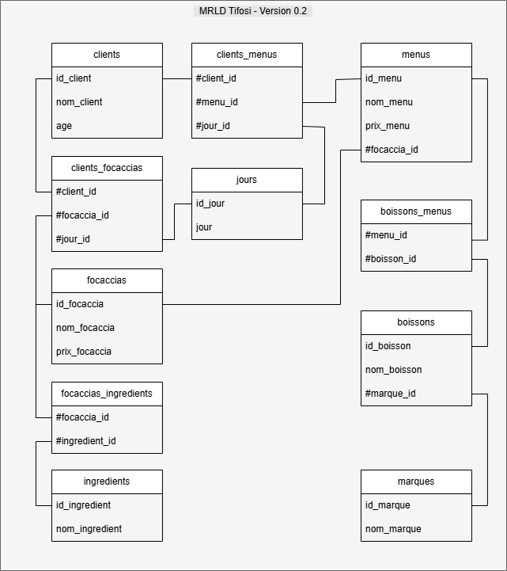

# 🧾 MRLD v0.2 – Tentative de centralisation du champ `jour`

_Rédigé par :_ PerLucCo  
_Dernière mise à jour :_ 18 juin 2025  

---

- [🧾 MRLD v0.2 – Tentative de centralisation du champ `jour`](#-mrld-v02--tentative-de-centralisation-du-champ-jour)
  - [📘 Contexte](#-contexte)
  - [🔗 Conventions appliquées](#-conventions-appliquées)
  - [📐 Hypothèse technique explorée](#-hypothèse-technique-explorée)
  - [🧱 Impact sur les tables](#-impact-sur-les-tables)
    - [📁 `jours`](#-jours)
    - [🔄 `clients_menus` (mise à jour)](#-clients_menus-mise-à-jour)
    - [🔄 `clients_focaccias` (mise à jour)](#-clients_focaccias-mise-à-jour)
  - [🖼️ Schéma logique](#️-schéma-logique)
  - [⚠️ Limites identifiées](#️-limites-identifiées)
  - [📎 En résumé](#-en-résumé)

---

## 📘 Contexte

La version `v0.1` du MRLD a révélé une **redondance problématique** du champ `jour`, présent dans deux relations :

- `clients_menus` (action `paye`)
- `clients_focaccias` (action `achète`)

Cette version `v0.2` explore une **centralisation du champ `jour`**, sans modifier la structure conceptuelle d’origine (`MCD v1`).  
Il s’agit d’une **tentative technique uniquement**, visant à factoriser les dates sans altérer la sémantique des actions client.

---

## 🔗 Conventions appliquées

- Voir [`MRLD_tifosi.md`](../MRLD_tifosi.md#-conventions-de-nommage-adoptées)
- Clés primaires : `id_<entité>`
- Clés étrangères : `#<entité>_id`
- Tables associatives : `<entité1>_<entité2>` (ordre alphabétique)

---

## 📐 Hypothèse technique explorée

👉 Introduction d’une nouvelle table **`jours`**, contenant les dates consommées dans le système.  
Elle permet de centraliser la colonne `jour` et de la relier via une clé étrangère dans les relations `clients_menus` et `clients_focaccias`.

---

## 🧱 Impact sur les tables

### 📁 `jours`

| Attribut   | Type     | Contrainte         |
|------------|----------|--------------------|
| id_jour    | INT      | PK, AUTO_INCREMENT |
| jour       | DATE     | UNIQUE, NOT NULL   |

---

### 🔄 `clients_menus` (mise à jour)

| Attribut        | Type     | Contrainte                |
|------------------|----------|---------------------------|
| #client_id       | INT      | FK → `clients`            |
| #menu_id         | INT      | FK → `menus`              |
| #jour_id         | INT      | FK → `jours`              |

---

### 🔄 `clients_focaccias` (mise à jour)

| Attribut        | Type     | Contrainte                |
|------------------|----------|---------------------------|
| #client_id       | INT      | FK → `clients`            |
| #focaccia_id     | INT      | FK → `focaccias`          |
| #jour_id         | INT      | FK → `jours`              |

---

## 🖼️ Schéma logique

📄 Fichier associé à créer : `mrld-v0.2_tifosi.drawio.png`  
📁 Localisation : `docs/implementation/mld/schemas/`

> 

---

## ⚠️ Limites identifiées

- Même si la **redondance technique** de `jour` est supprimée, la **structure conceptuelle reste incohérente** :  
  → la date est désormais centralisée **sans entité logique regroupante** entre client, date et objet.

- Cette version soulève donc une **problématique sémantique** : on manipule une date indépendante mais sans signification métier forte (≠ commande, ≠ session).

- Cette difficulté justifie une **reprise du MCD (v1 → v2)** pour introduire une entité conceptuelle `jours`.

---

## 📎 En résumé

Cette version `v0.2` marque un **pivot dans l’analyse structurelle**.  
Elle expose les **limites d’une simple optimisation relationnelle**, et conduit logiquement à une **évolution conceptuelle du MCD** (prochaine étape).

---
