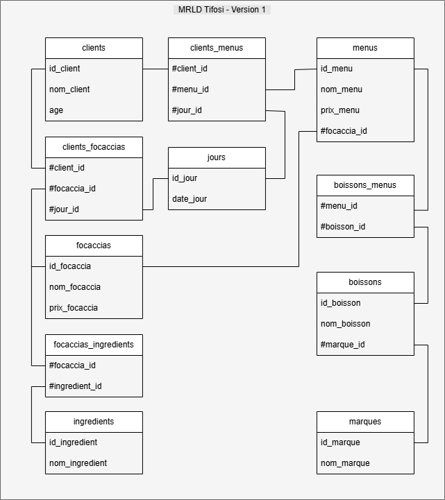

# 🧾 MRLD v1 — Modèle Relationnel Logique de Données (Tifosi)

_Rédigé par :_ PerLucCo  
_Dernière mise à jour :_ 22 juin 2025

---

## 📘 Objectif

Ce document présente la version **stabilisée et de référence** du **Modèle Relationnel Logique de Données (MRLD)** du projet Tifosi.

Elle est issue de la transposition complète du **MCD v2**, avec une attention portée à :

- la **normalisation des relations n,n et ternaires**,
- la **centralisation de la date** via l’entité `jours`,
- la **cohérence terminologique** entre les objets métier et les structures relationnelles,
- une **souplesse contrôlée sur la granularité temporelle** pour adapter le modèle physique (MPD) selon les besoins.

Ce MRLD v1 est destiné à servir de base pour la création du MPD et des requêtes SQL.

---

## 🔗 Conventions appliquées

- Voir [`MRLD_tifosi.md`](../MRLD_tifosi.md#-conventions-de-nommage-adoptées)
  - Clés primaires : `id_<entité>`
  - Clés étrangères : `#<entité>_id`
  - Tables associatives : `<entité1>_<entité2>` (ordre alphabétique)

---

## 🧱 Tables principales

### `clients`

| Champ       | Type    | Contrainte |
|-------------|---------|------------|
| id_client   | INT     | PK         |
| nom_client  | VARCHAR | NOT NULL   |
| age         | INT     | NULL       |

---

### `menus`

| Champ        | Type     | Contrainte       |
|--------------|----------|------------------|
| id_menu      | INT      | PK               |
| nom_menu     | VARCHAR  | NOT NULL         |
| prix_menu    | DECIMAL  | NULL             |
| #focaccia_id | INT      | FK → `focaccias` |

---

### `focaccias`

| Champ         | Type     | Contrainte |
|---------------|----------|------------|
| id_focaccia   | INT      | PK         |
| nom_focaccia  | VARCHAR  | NOT NULL   |
| prix_focaccia | DECIMAL  | NULL       |

---

### `boissons`

| Champ        | Type     | Contrainte |
|--------------|----------|------------|
| id_boisson   | INT      | PK         |
| nom_boisson  | VARCHAR  | NOT NULL   |

---

### `marques`

| Champ       | Type     | Contrainte |
|-------------|----------|------------|
| id_marque   | INT      | PK         |
| nom_marque  | VARCHAR  | NOT NULL   |

---

### `ingredients`

| Champ           | Type     | Contrainte |
|------------------|----------|-----------|
| id_ingredient    | INT      | PK        |
| nom_ingredient   | VARCHAR  | NOT NULL  |

---

### `jours` — Référentiel temporel des actions datées

| Champ       | Type             | Contrainte              |
|-------------|------------------|--------------------------|
| id_jour     | INT              | PK                      |
| date_jour   | DATE / DATETIME / TIMESTAMP | UNIQUE, NOT NULL |

>💡 **Remarque :**  
>Le type exact de `date_jour` est volontairement **laissé ouvert** à ce niveau logique.
>
>Cela permet d’adapter le MPD selon le niveau de granularité temporelle souhaité :
>
>- `DATE` → une action est unique **à la journée** (ex. : 1 paiement par jour pour un même menu et client),
>- `DATETIME` ou `TIMESTAMP` → permet d’enregistrer **plusieurs actions identiques** dans une même journée (ex. : deux achats d’une même focaccia à des heures différentes).
>
>Le champ `#jour_id` référencé dans les relations associatives ternaires porte cette responsabilité logique. **C’est la précision du champ `date_jour` qui conditionne l’unicité d’une action enregistrée.**

---

## 🔄 Tables associatives binaires et n,n

### `focaccias_ingredients`

| Champ          | Type | Contrainte         |
|----------------|------|--------------------|
| #focaccia_id   | INT  | FK → `focaccias`   |
| #ingredient_id | INT  | FK → `ingredients` |

✅ **PK** composée : (`#focaccia_id`, `#ingredient_id`)

---

### `boissons_menus`

| Champ        | Type | Contrainte      |
|--------------|------|-----------------|
| #boisson_id  | INT  | FK → `boissons` |
| #menu_id     | INT  | FK → `menus`    |

✅ **PK** composée : (`#menu_id`, `#boisson_id`)

---

## 🔺 Tables associatives ternaires (relations datées)

### `clients_menus`

| Champ        | Type | Contrainte              |
|--------------|------|-------------------------|
| #client_id   | INT  | FK → `clients`          |
| #menu_id     | INT  | FK → `menus`            |
| #jour_id     | INT  | FK → `jours`            |

✅ **PK** composée : (`#client_id`, `#menu_id`, `#jour_id`)
ℹ️ L’unicité d’une action repose sur la combinaison `(client, objet, moment)` — encodée par la PK composite.  
Le champ `#jour_id` porte une date ou un horodatage selon la configuration choisie dans la table `jours`.

---

### `clients_focaccias`

| Champ         | Type | Contrainte              |
|---------------|------|-------------------------|
| #client_id    | INT  | FK → `clients`          |
| #focaccia_id  | INT  | FK → `focaccias`        |
| #jour_id      | INT  | FK → `jours`            |

✅ **PK** composée : (`#client_id`, `#focaccia_id`, `#jour_id`)
ℹ️ L’unicité d’une action repose sur la combinaison `(client, objet, moment)` — encodée par la PK composite.  
Le champ `#jour_id` porte une date ou un horodatage selon la configuration choisie dans la table `jours`.

---

## 🖼️ Schéma associé

📁 

---

## 📎 Références

- MCD source : [`MCD-v2_tifosi.md`](../../mcd/versions/MCD-v2_tifosi.md)
- Historique associé : [`HISTORIQUE_mld_tifosi.md`](./HISTORIQUE_mld_tifosi.md)
- Schéma MCD source : [`MCD-v2_tifosi.drawio.png`](../../mcd/schemas/MCD-v2_tifosi.drawio.png)
- Schéma MLD source : [`mrld-v1_tifosi.drawio.png`](../schemas/mrld-v1_tifosi.drawio.png)
