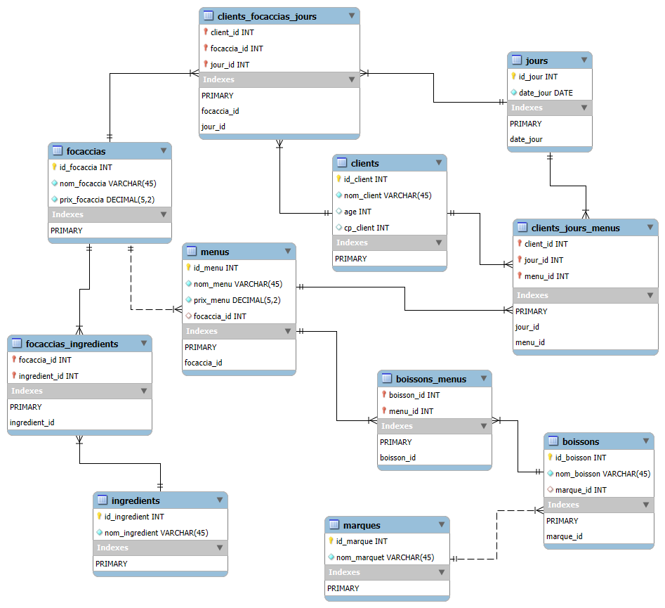

# 🧪 README_test-v0.1.3.md — Protocole de test de la base `tifosi_v013`

---

- [🧪 README\_test-v0.1.3.md — Protocole de test de la base `tifosi_v013`](#-readme_test-v013md--protocole-de-test-de-la-base-tifosi_v013)
  - [🎯 Objectif](#-objectif)
  - [🛠️ Pré-requis](#️-pré-requis)
  - [📂 Scripts de test utilisés](#-scripts-de-test-utilisés)
  - [🔍 Contenu des tests](#-contenu-des-tests)
  - [⚖️ Résultats des tests fonctionnels](#️-résultats-des-tests-fonctionnels)
  - [💡 Résultats attendus](#-résultats-attendus)
    - [📊 Résultats obtenus](#-résultats-obtenus)
      - [🧱 Schéma relationnel généré (EER Workbench)](#-schéma-relationnel-généré-eer-workbench)
      - [🔎 Résultats des requêtes de validation](#-résultats-des-requêtes-de-validation)

---

## 🎯 Objectif

Ce document décrit le protocole de vérification fonctionnelle de la version `v0.1.3` de la base de données `tifosi`. Il s'agit de valider la cohérence de la structure relationnelle, le bon fonctionnement des contraintes d'intégrité, ainsi que les privilèges de l'utilisateur `tifosi`.

---

## 🛠️ Pré-requis

1. La base `tifosi_v013` doit être créée via le script d’initialisation :

    ```bash
    mysql -u root -p < init_v013.sql
    ```

    >⚠️ En environnement PowerShell, cette commande renverra une erreur (< non reconnu). Dans ce cas, passez d'abord en console CMD avec la commande : _cmd_
    >
    >⚠️ l'utilisateur pour la mise en place de l'initialisation est `root`.

2. L’utilisateur `tifosi` doit avoir été créé et disposer des droits sur la base `tifosi_v013`.

3. Les tests doivent être exécutés sous l’utilisateur `tifosi` (et non `root`) pour simuler un environnement applicatif restreint :

    ```bash
    mysql -u tifosi -p < test_v013.sql
    ```

    >⚠️ En environnement PowerShell, cette commande renverra une erreur (< non reconnu). Dans ce cas, passez d'abord en console CMD avec la commande : _cmd_
    >
    >⚠️ l'utilisateur pour la mise en place de l'initialisation est `tifosi` avec le mot de passe `TifosiPwd_24`.

---

## 📂 Scripts de test utilisés

- Pour l'utilisateur `root` :
  - `create_tifosi.sql` : création de la base (structure seule)
  - `create_user_tifosi.sql` : création de l'utilisateur `tifosi`
  - `init_v013.sql` :  script d’automatisation combinant les deux ci-dessus
- Pour l'utilisateur `tifosi` :
  - `data-test_v013.sql` : chargement d’un jeu de données de validation
  - `queries-test_v013.sql` : requêtes de test pour vérifier la cohérence
  - `test_v013.sql` : script d’automatisation combinant les deux ci-dessus

---

## 🔍 Contenu des tests

| Domaine              | Vérification                                                              |
|----------------------|---------------------------------------------------------------------------|
| Clients              | insertion correcte et lecture possible                                   |
| Menus & focaccias    | association via FK + visualisation                                        |
| Boissons & marques   | liaison et attribution correcte (FK avec `ON DELETE SET NULL`)           |
| Ingrédients          | relation N:N entre `focaccias` et `ingredients`                          |
| Consommations        | relations ternaires (`clients_jours_menus`, `clients_focaccias_jours`)   |
| Droits utilisateur   | accès en lecture/écriture autorisé sur `tifosi_v013`, rien d’autre        |

---

## ⚖️ Résultats des tests fonctionnels

## 💡 Résultats attendus

- Toutes les requêtes retournent des lignes valides, sans erreur de clé ou contrainte
- Aucune violation de FK (les cas limites ont été évités)
- L'utilisateur `tifosi` ne peut pas accéder aux autres bases (test en option)

---

### 📊 Résultats obtenus

#### 🧱 Schéma relationnel généré (EER Workbench)

Le schéma a été généré à partir de la base `tifosi_v013` via la fonction **"Reverse Engineer"** de MySQL Workbench.

- 📍 Fichier modèle : `sql-v0.1.3/model_tifosi_v013.mwb`
- 📷 Export visuel : 

**Observations :**

- Toutes les entités sont correctement reliées par leurs clés étrangères.
- Les deux relations ternaires (`clients_jours_menus`, `clients_focaccias_jours`) sont correctement représentées.
- **Limite visuelle Workbench** : seules les premières colonnes des clés primaires composées sont annotées visuellement (voir remarque en section précédente).

>**🧠 Remarque :**
>
>Dans l’éditeur EER de MySQL Workbench, seules les **premières colonnes des clés primaires composées** sont annotées `PK`. Les autres sont bien intégrées à la contrainte, mais invisibles graphiquement. Cela est notamment le cas dans `clients_focaccias_jours`.

---

#### 🔎 Résultats des requêtes de validation

Les requêtes présentes dans `queries-test_v013.sql`, exécutées avec l’utilisateur `tifosi`, retournent les résultats attendus :

| Test                                  | 🧪 Résultat attendu | 🧾 Commentaire                                  |
|---------------------------------------|---------------------|------------------------------------------------|
| Clients présents                      | Oui                 | `Alice` et `Bruno` correctement insérés        |
| Menus + Focaccias associés            | Oui                 | `Formule midi` → `Classica`, `Veggie` → `Verde` |
| Menus + Boissons associés             | Oui                 | Limonata & Coca Zéro bien reliés               |
| Focaccias + Ingrédients               | Oui                 | `Mozzarella` et `Roquette` selon les recettes  |
| Historique de consommation (menus)    | Oui                 | Dates et menus consommés par chaque client     |
| Historique de consommation (focaccias)| Oui                 | Alice → `Verde` le 11 juin                     |
| Droits utilisateur                    | Oui                 | Insertion/lecture autorisées, pas d'accès à `mysql`, `information_schema`, etc. |

---
