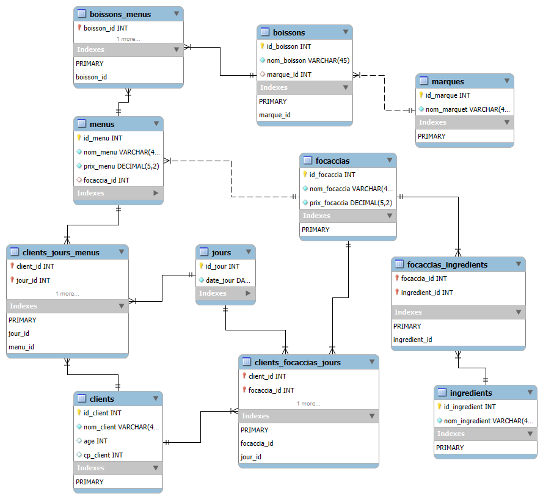

# 🧪 README_test-v0.2.0.md — Requêtes de validation de la base `tifosi`

**Base cible** : `tifosi`  
**Modèle** : MPD v0.2.0  
**Données chargées via** : `insert_data.sql`  
**Script de test** : `queries-test_v020.sql`  
**Auteur** : PerLucCo  
**Date** : 25 juin 2025

---

- [🧪 README\_test-v0.2.0.md — Requêtes de validation de la base `tifosi`](#-readme_test-v020md--requêtes-de-validation-de-la-base-tifosi)
  - [🎯 Objectif](#-objectif)
  - [🛠️ Pré-requis](#️-pré-requis)
    - [📂 Scripts de test utilisés](#-scripts-de-test-utilisés)
    - [🔍 Contenu des tests](#-contenu-des-tests)
      - [📄 Script : `queries-test_v020.sql`](#-script--queries-test_v020sql)
      - [✅ Conditions de fonctionnement](#-conditions-de-fonctionnement)
      - [🚀 Exécution du test de validation](#-exécution-du-test-de-validation)
  - [⚖️ Résultats des tests fonctionnels](#️-résultats-des-tests-fonctionnels)
    - [💡 Résultats attendus](#-résultats-attendus)
    - [📊 Résultats obtenus](#-résultats-obtenus)
      - [🧱 Schéma relationnel généré (EER Workbench)](#-schéma-relationnel-généré-eer-workbench)
      - [🔎 Résultats des requêtes de validation](#-résultats-des-requêtes-de-validation)
  - [📘 Remarque](#-remarque)

---

## 🎯 Objectif

Vérifier la structure et la cohérence des données insérées dans la base `tifosi`, notamment :

- la création de la structure de la base et de l'utilisateur `tifosi`
- la bonne insertion des données boissons.csv, ingrédients.csv, marques.csv, focaccias.csv et de la liaison boissons avec marques et de focaccias avec ingredients.
- l’exploitation en lecture des principales entités métiers `boissons` et `focaccias`

---

## 🛠️ Pré-requis

1. La base `tifosi` doit être créée via le script d’initialisation :

    ```bash
    mysql -u root -p < create_tifosi.sql
    ```

    >⚠️ En environnement PowerShell, cette commande renverra une erreur (< non reconnu). Dans ce cas, passez d'abord en console CMD avec la commande : _cmd_
    >
    >⚠️ l'utilisateur pour la mise en place de l'initialisation est `root`.

2. L’utilisateur `tifosi` doit avoir été créé et disposer des droits sur la base `tifosi_v013`.

3. Les tests doivent être exécutés sous l’utilisateur `tifosi` (et non `root`) pour simuler un environnement applicatif restreint :

    ```bash
    mysql -u tifosi -p < insert_data.sql
    ```

    >⚠️ En environnement PowerShell, cette commande renverra une erreur (< non reconnu). Dans ce cas, passez d'abord en console CMD avec la commande : _cmd_
    >
    >⚠️ l'utilisateur pour la mise en place de l'initialisation est `tifosi` avec le mot de passe `TifosiPwd_24`.

---

### 📂 Scripts de test utilisés

- Pour l'utilisateur `root` :
  - `create_tifosi.sql` : création de la base (structure seule) et de l'utilisateur `tifosi`
- Pour l'utilisateur `tifosi` :
  - `insert_data.sql` : chargement d’un jeu de données de validation
  - `queries-test_v020.sql` : requêtes de test pour vérifier la cohérence

---

### 🔍 Contenu des tests

| Domaine                 | Vérification                                                         |
|-------------------------|----------------------------------------------------------------------|
| Droits utilisateur      | accès en lecture/écriture autorisé sur `tifosi`, rien d’autre        |
| Clients                 | insertion correcte et lecture possible                               |
| Boissons & marques      | liaison et attribution correcte (FK avec `ON DELETE SET NULL`)       |
| focaccias & Ingrédients | relation N:N entre `focaccias` et `ingredients`                      |
| autres tables vides     | tables vides `menus`, `clients`, `jours` et relations associées      |

#### 📄 Script : `queries-test_v020.sql`

Ce script contient :

- des requêtes `SELECT *` simples de vérification
- des jointures permettant de relier les entités :

```sql
-- Ex. ingrédients d’une focaccia
SELECT f.nom_focaccia, i.nom_ingredient
FROM focaccias f
JOIN focaccias_ingredients fi ON f.id_focaccia = fi.focaccia_id
JOIN ingredients i ON fi.ingredient_id = i.id_ingredient;
```

---

#### ✅ Conditions de fonctionnement

Avant d’exécuter ce script :

1. La base doit avoir été créée avec `create_tifosi.sql`
2. Les données doivent avoir été insérées avec succès via `insert_data.sql`
3. L’utilisateur `tifosi` doit être utilisé pour valider les droits

---

#### 🚀 Exécution du test de validation

```bash
mysql -u tifosi -p < queries-test_v020.sql
```

Le résultat attendu s’affiche dans le terminal ou dans l’onglet SQL de Workbench.

---

## ⚖️ Résultats des tests fonctionnels

### 💡 Résultats attendus

- Toutes les requêtes retournent des lignes valides, sans erreur de clé ou contrainte
- Aucune violation de FK (les cas limites ont été évités)
- Les tables `boissons`, `marques`, `focaccias` et `ìngredient`
- La composition de chaque focaccias est accessible
- L'utilisateur `tifosi` ne peut pas accéder aux autres bases (test en option)

---

### 📊 Résultats obtenus

#### 🧱 Schéma relationnel généré (EER Workbench)

Le schéma a été généré à partir de la base `tifosi` via la fonction **"Reverse Engineer"** de MySQL Workbench.

- 📍 Fichier modèle : `sql-v0.1.3/model_tifosi_v020.mwb`
- 📷 Export visuel : 

**Observations :**

- Toutes les entités sont correctement reliées par leurs clés étrangères.
- Les deux relations ternaires (`clients_jours_menus`, `clients_focaccias_jours`) sont correctement représentées.
- **Limite visuelle Workbench** : seules les premières colonnes des clés primaires composées sont annotées visuellement (voir remarque en section précédente).

>**🧠 Remarque :**
>
>Dans l’éditeur EER de MySQL Workbench, seules les **premières colonnes des clés primaires composées** sont annotées `PK`. Les autres sont bien intégrées à la contrainte, mais invisibles graphiquement. Cela est notamment le cas dans `clients_focaccias_jours`.

---

#### 🔎 Résultats des requêtes de validation

Les requêtes présentes dans `queries-test_v020.sql`, exécutées avec l’utilisateur `tifosi`, retournent les résultats attendus :

| Test                                  | 🧪 Résultat attendu | 🧾 Commentaire |
|---------------------------------------|---------------------|-----------------|
| Clients présents                      | 🚫 Non  | Table vide  |
| Menus + Focaccias associés            | 🚫 Non  | Table vide  |
| Menus + Boissons associés             | 🚫 Non  | Table vide  |
| Focaccias + Ingrédients               | ✅ Oui  | Selon tableau _composition des focaccias_ |
| Historique de consommation (menus)    | 🚫 Non  | Table vide  |
| Historique de consommation (focaccias)| 🚫 Non  | Table vide  |
| Droits utilisateur                    | ✅ Oui  | Insertion/lecture autorisées, pas d'accès à `mysql`, `information_schema`, etc. |

---

**Tableau de composition des focaccias :**

| id_focaccia | nom_focaccia | prix_focaccia | ingrédients |
|--|--|--|--|
| 1 | Mozaccia         | 9.80 | Ail, Artichaut, Base tomate, Champignon, Cresson, Jambon fumé, Mozarella, Olive noire, Parmesan, Poivre |
| 2 | Gorgonzollaccia  | 10.80 | Ail, Base tomate, Champignon, Cresson, Gorgonzola, Olive noire, Parmesan, Poivre |
| 3 | Raclaccia        | 8.90 | Ail, Base tomate, Champignon, Cresson, Parmesan, Poivre, Raclette |
| 4 | Emmentalaccia    | 9.80 | Base crème, Champignon, Cresson, Emmental, Oignon, Parmesan, Poivre |
| 5 | Tradizione       | 8.90 | Base tomate, Champignon, Cresson, Jambon cuit, Mozarella, Olive noire, Olive verte, Parmesan, Poivre |
| 6 | Hawaienne        | 11.20 | Ananas, Bacon, Base tomate, Cresson, Mozarella, Olive noire, Parmesan, Piment, Poivre |
| 7 | Américaine       | 10.80 | Bacon, Base tomate, Cresson, Mozarella, Olive noire, Parmesan, Poivre, Pomme de terre |
| 8 | Paysanne         | 12.80 | Ail, Artichaut, Base crème, Champignon, Chèvre, Cresson, Jambon fumé, Oeuf, Olive noire, Parmesan, Poivre, Pomme de terre |

---

## 📘 Remarque

Ce fichier est hérité de `queries-test_v013.sql` et **entièrement compatible** avec la structure consolidée `v0.2.0` et la base renommée `tifosi`.
