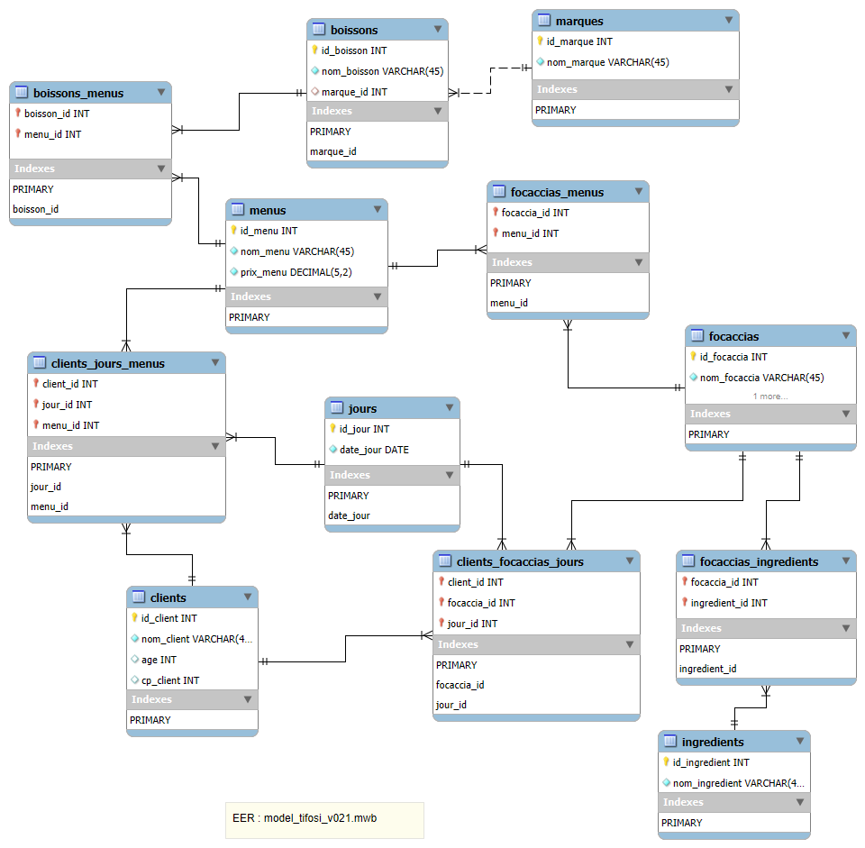

# 🧪 README_test-v0.2.1.md — Requêtes de validation de la base `tifosi`

**Base cible** : `tifosi`  
**Modèle** : MPD v0.2.1  
**Données chargées via** : `insert_data.sql`  
**Script de test** : `queries-test_v021.sql`  
**Auteur** : PerLucCo  
**Date** : 27 juin 2025

---

- [🧪 README\_test-v0.2.1.md — Requêtes de validation de la base `tifosi`](#-readme_test-v021md--requêtes-de-validation-de-la-base-tifosi)
  - [🎯 Objectif](#-objectif)
  - [🧪 Version validée MPDv0.2.1](#-version-validée-mpdv021)
  - [🛠️ Pré-requis](#️-pré-requis)
    - [📂 Scripts de test utilisés](#-scripts-de-test-utilisés)
    - [🔍 Contenu des tests](#-contenu-des-tests)
      - [📄 Script : `queries-test_v021.sql`](#-script--queries-test_v021sql)
      - [✅ Conditions de fonctionnement](#-conditions-de-fonctionnement)
      - [🚀 Exécution du test de validation](#-exécution-du-test-de-validation)
  - [⚖️ Résultats des tests fonctionnels](#️-résultats-des-tests-fonctionnels)
    - [💡 Résultats attendus](#-résultats-attendus)
    - [📊 Résultats obtenus](#-résultats-obtenus)
      - [🧱 Schéma relationnel généré (EER Workbench)](#-schéma-relationnel-généré-eer-workbench)
      - [🔎 Résultats des requêtes de validation](#-résultats-des-requêtes-de-validation)
  - [📊 Jeu de données de test injecté](#-jeu-de-données-de-test-injecté)
  - [📘 Remarque](#-remarque)

---

## 🎯 Objectif

Vérifier la structure et la cohérence des données insérées dans la base `tifosi`, notamment :

- la création de la structure de la base et de l'utilisateur `tifosi`
- la bonne insertion des données boissons.csv, ingrédients.csv, marques.csv, focaccias.csv et de la liaison boissons avec marques et de focaccias avec ingredients.
- l’exploitation en lecture des principales entités métiers `boissons` et `focaccias`

---

## 🧪 Version validée MPDv0.2.1

Les tests ont été réalisés sur deux itérations du modèle physique :

- Version initiale : avec clés primaires composites (`focaccias_menus`, `boissons_menus`)
- Version finale : avec identifiants techniques (`id_focaccia_menu`, `id_boisson_menu`), conformément à l’issue #6.1

Les exports `result-queries-test_v021-initial.txt` et `...-final.txt` permettent de tracer les deux validations successives.

---

## 🛠️ Pré-requis

1. La base `tifosi` doit être créée via le script d’initialisation :

    ```bash
    mysql -u root -p < create_tifosi.sql
    ```

    >⚠️ En environnement PowerShell, cette commande renverra une erreur (< non reconnu). Dans ce cas, passez d'abord en console CMD avec la commande : _cmd_
    >
    >⚠️ l'utilisateur pour la mise en place de l'initialisation est `root`.

2. L’utilisateur `tifosi` doit avoir été créé et disposer des droits sur la base `tifosi_v013`.

3. Les tests doivent être exécutés sous l’utilisateur `tifosi` (et non `root`) pour simuler un environnement applicatif restreint :

    ```bash
    mysql -u tifosi -p < insert_data.sql
    ```

    >⚠️ En environnement PowerShell, cette commande renverra une erreur (< non reconnu). Dans ce cas, passez d'abord en console CMD avec la commande : _cmd_
    >
    >⚠️ l'utilisateur pour la mise en place de l'initialisation est `tifosi` avec le mot de passe `TifosiPwd_24`.

---

### 📂 Scripts de test utilisés

- Pour l'utilisateur `root` :
  - `create_tifosi.sql` : création de la base (structure seule) et de l'utilisateur `tifosi`
- Pour l'utilisateur `tifosi` :
  - `insert_data.sql` : chargement d’un jeu de données de validation
  - `queries-test_v021.sql` : requêtes de test pour vérifier la cohérence

---

### 🔍 Contenu des tests

| Domaine                 | Vérification                                                         |
|-------------------------|----------------------------------------------------------------------|
| Droits utilisateur      | accès en lecture/écriture autorisé sur `tifosi`, rien d’autre        |
| Clients                 | insertion correcte et lecture possible                               |
| Boissons & marques      | liaison et attribution correcte (FK avec `ON DELETE SET NULL`)       |
| focaccias & Ingrédients | relation N:N entre `focaccias` et `ingredients`                      |
| autres tables vides     | tables vides `menus`, `clients`, `jours` et relations associées      |

#### 📄 Script : `queries-test_v021.sql`

Ce script contient :

- des requêtes `SELECT COUNT(*)`, `SELECT *` simples de vérification
- des jointures permettant de relier les entités :
  - ingredients d'une focaccia
  - boissons présentes dans le menu
  - menus payés par clients un jour donné
  - focaccias achétées par clients un jour donné
- Vérification des relation N:N et ternaires avec et sans `JOIN`

```sql
-- Ex. ingrédients d’une focaccia
SELECT f.nom_focaccia, i.nom_ingredient
FROM focaccias f
JOIN focaccias_ingredients fi ON f.id_focaccia = fi.focaccia_id
JOIN ingredients i ON fi.ingredient_id = i.id_ingredient;
```

---

#### ✅ Conditions de fonctionnement

Avant d’exécuter ce script :

1. La base doit avoir été créée avec `create_tifosi.sql`
2. Les données doivent avoir été insérées avec succès via `insert_data.sql`
3. L’utilisateur `tifosi` doit être utilisé pour valider les droits

---

#### 🚀 Exécution du test de validation

```bash
mysql -u tifosi -p < queries-test_v021.sql
```

Le résultat attendu s’affiche dans le terminal ou dans l’onglet SQL de Workbench.

---

## ⚖️ Résultats des tests fonctionnels

### 💡 Résultats attendus

- Toutes les requêtes retournent des lignes valides, sans erreur de clé ou contrainte
- Aucune violation de FK (les cas limites ont été évités)
- Les tables `boissons`, `marques`, `focaccias` et `ìngredient`
- La composition de chaque focaccias est accessible
- Les boissons présentes dans les menus
- Les menus payés par les clients un jour donné
- Les focaccias achetées par les clients un jour donné
- L'utilisateur `tifosi` ne peut pas accéder aux autres bases (test en option)

---

### 📊 Résultats obtenus

#### 🧱 Schéma relationnel généré (EER Workbench)

Le schéma a été généré à partir de la base `tifosi` via la fonction **"Reverse Engineer"** de MySQL Workbench.

- 📍 Fichier modèle : `sql-v0.2.1/model_tifosi_v021.mwb`
- 📷 Export visuel :
  - Version initiale avant cycle de _instantiation-validation_ : 
  - Version finale avec optimisation des clés primaires composées : 

**Observations :**

- Toutes les entités sont correctement reliées par leurs clés étrangères.
- Les deux relations ternaires (`clients_jours_menus`, `clients_focaccias_jours`) sont correctement représentées.
- **Limite visuelle Workbench** : seules les premières colonnes des clés primaires composées sont annotées visuellement (voir remarque en section précédente).

>**🧠 Remarque :**
>
>Dans l’éditeur EER de MySQL Workbench, seules les **premières colonnes des clés primaires composées** sont annotées `PK`. Les autres sont bien intégrées à la contrainte, mais invisibles graphiquement. Cela est notamment le cas dans `clients_focaccias_jours`.

---

#### 🔎 Résultats des requêtes de validation

Les requêtes présentes dans `queries-test_v021.sql`, exécutées avec l’utilisateur `tifosi`, retournent les résultats attendus en conformité avec [`DATAS-TESTING.md`](./DATAS-TESTING.md) :

| Test                                  | 🧪 Résultat attendu | 🧾 Commentaire |
|---------------------------------------|---------------------|-----------------|
| Clients présents                      | ✅ Oui  | Selon tableau _Clients_ |
| Menus + Focaccias associés            | ✅ Oui  | Selon tableau _activités des menus_ |
| Menus + Boissons associés             | ✅ Oui  | Selon tableau _activités des menus_ |
| Focaccias + Ingrédients               | ✅ Oui  | Selon tableau _composition des focaccias_ |
| Historique de consommation (menus)    | ✅ Oui  | Selon tableau _activités des menus_ |
| Historique de consommation (focaccias)| ✅ Oui  | Selon tableau _activités des menus / focaccias_  |
| Droits utilisateur                    | ✅ Oui  | Insertion/lecture autorisées, pas d'accès à `mysql`, `information_schema`, etc. |

---

## 📊 Jeu de données de test injecté

Le jeu de données utilisé pour tester la version MPD v0.2.1 est décrit en détail dans le fichier suivant :

👉 [Voir la synthèse des jeux de données — `DATAS-TESTING.md`](./DATAS-TESTING.md)

Ce fichier contient :

- La liste complète des ingrédients, boissons, focaccias, menus, etc.
- Des tableaux synthétiques des relations binaires et ternaires (ex. : composition des focaccias, menus payés, focaccias achetées).
- Une représentation claire et métier des données utilisées pendant les tests.

Les fichiers sources (.csv) utilisés pour l’insertion réelle sont accessibles dans : [`/docs/implementation/sql/sql-v0.2/versions/sql-v0.2.1/datas-csv/`](./datas-csv/)

---

## 📘 Remarque

Ce fichier est hérité de `queries-test_v020.sql` et **entièrement compatible** avec la structure consolidée `v0.2.1` et la base renommée `tifosi`.

Le script utilise uniquement des clés étrangères avec `ON DELETE CASCADE` sauf pour boissons → marques (`SET NULL`)

Aucune violation de contrainte détectée à l’insertion.

Requêtes testées depuis le terminal **CMD** de **Visual Studio Code** et le client lourd **MySQL Workbench**.
